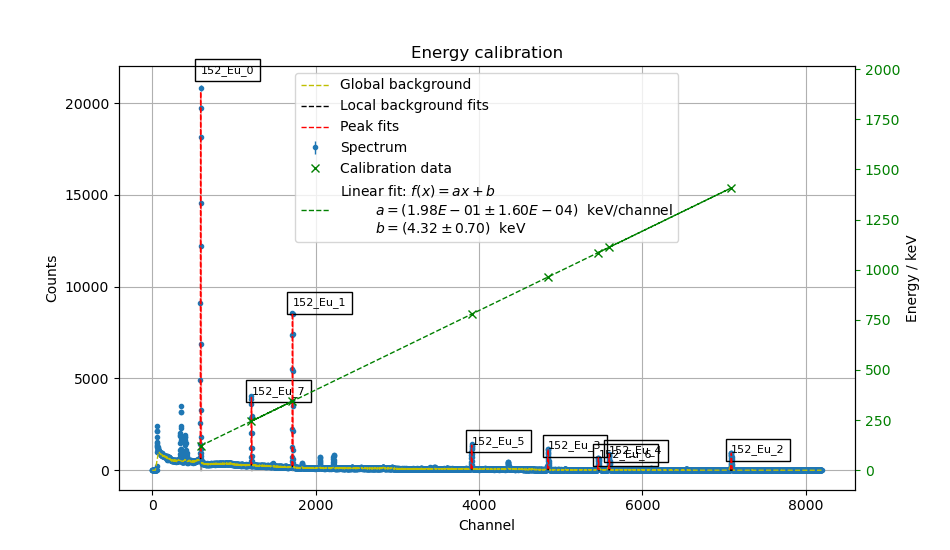

==================================
Irrad_Spectroscopy |test-status|
==================================

Introduction
============

``ìrrad_spectroscopy`` is a package which provides functions for gamma and X-ray spectroscopy, including isotope identification, activity determination and spectral dose calculations.
Furthermore, it offers functions for calculating the gamma equivalent dose for given isotopes as a function of their initial activity.
The package was developed for spectroscopic analysis or proton-irradiated semiconductoir detector devices but can be used to analyze various samples
from radioactive sources to activated machine parts. It consits of few independent methods which togehter allow for a complete spectroscopic analysis, including plotting, of
radioactive gamma-spectra. A step-by-step full spectroscopy of an example spectrum can be found in the ``examples`` folder.

Installation
============

You have to have Python 3 with the following packages installed:

- numpy
- scipy
- pyyaml
- matplotlib
- jupyter (examples)
- pandas (creating gamma library from the web)

It's recommended to use a Python environment like `Miniconda <https://conda.io/miniconda.html>`_. After installation you can use Minicondas package manager ``conda`` to install the required packages

.. code-block:: bash

   conda install numpy scipy pyyaml matplotlib jupyter pandas

To finally install ``irrad_spectroscopy`` run the setup file

.. code-block:: bash

   python setup.py develop

Example usage
=============

Full spectroscopy
-----------------

Check the ``examples`` folder for several measured data sets of different sources for calibration and analysis. A `Jupyter Notebook <http://jupyter.org/>`_
with a step-by-step analysis of an example spectrum of an irradiated chip is provided. Install jupyter and run

.. code-block:: bash
   
   jupyter notebook

in order to open the web interface.

Eqivalent dose calculation
--------------------------

Calculating the gamma dose rate of a single gamma line

.. code-block:: python

   # Import 
   from irrad_spectroscopy.physics import gamma_dose_rate

   # Get dose rate of single gamma line in uSv/h
   # Zn65 line at 1115.564 keV, prob 50.60%, activity of 20 kBq at a distance of 100 cm in air
   gamma_dose_rate(energy=1115.546, probability=0.506, activity=20e3, distance=100, material='air')
   # Prints 1.515e-3  # uSv/h

Calculating the (integrated) gamma dose rate of (an) isotope(s)

.. code-block:: python

   # Import 
   from irrad_spectroscopy.physics import isotope_dose_rate

   # Get dose rate of isotope in uSv/h
   # Zn65 with activity of 20 kBq at a distance of 100 cm in air
   isotope_dose_rate(isotope='65_Zn', activity=20e3, distance=100, material='air')
   # Prints {'65_Zn': 1.515e-3}  # uSv/h

   # Multiple isotopes with different activities at a distance of 100 cm in air
   isotope_dose_rate(isotope=('65_Zn', '7_Be'), activity=(20e3, 100e3), distance=100, material='air')
   # Prints {'65_Zn': 1.515e-3, '7_Be': 0.73e-3}  # uSv/h

   # Multiple isotopes with different activities at a distance of 100 cm in air integrated over 2000 hours
   isotope_dose_rate(isotope=('65_Zn', '7_Be'), activity=(20e3, 100e3), distance=100, material='air', time=2000)
   # Prints {'65_Zn': 2.66, '7_Be': 0.89}  # uSv/h

Structure
=========

The general approach to perform a spectroscopy is divided into the following steps:

Energy calibartion with a known source
--------------------------------------

  
Efficiency calibration with a known source
------------------------------------------

.. image:: static/figs/efficiency_calib_eu152.png

Fitting of spectrum of unknown sample
-------------------------------------

Testing
=======

The code in this package has unit-tests. These tests contain a benchmark with actual gamma-spectroscopy data of
two calibrated, radioactive sources, namely 22-Na and 133-Ba. The activity reconstruction efficiencies for the 
tested data sets are tested to be above 90%.
 
.. |test-status| image:: https://github.com/Silab-Bonn/irrad_spectroscopy/actions/workflows/main.yml/badge.svg?branch=development
    :target: https://github.com/SiLab-Bonn/irrad_spectroscopy/actions
    :alt: Build status
